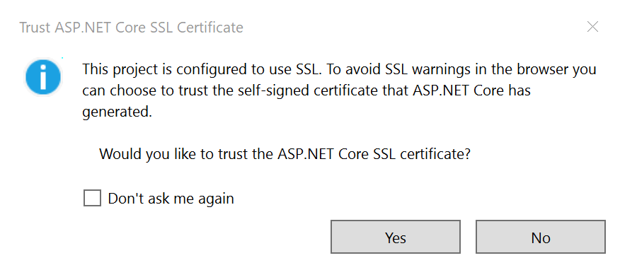
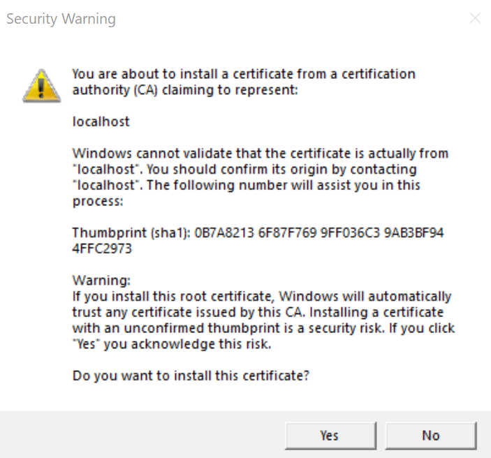
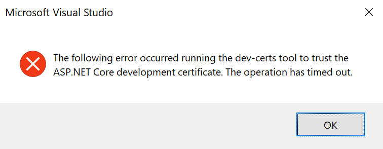

# com.barghgir.plc.web

A multiplatform application for servicing Powerful Life Coaching content.

# com.barghgir.plc.api

The Application Program Interface (API) that support back-end business data layer to provide data to features like Courses, and content/media.

## Connect to localhost

https://learn.microsoft.com/en-us/dotnet/maui/data-cloud/local-web-services?view=net-maui-7.0

## Trust SSL Certificate

During initial start of API project, the SSL require trust of certificate, and prompts as follows:

1. Answer 'Yes' to the dialog about trusting the certificate.

| { width=50% }
|:--:|

2. Again, answer 'Yes' to the dialog about installing certificate.

| { width=50% }
|:--:|

3. Answer 'Yes' to the dialog

| { width=50% }
|:--:|

# References

1. [Material Icons](https://github.com/AathifMahir/MauiIcons)
2. [Converyor extension for VS 2022](https://marketplace.visualstudio.com/items?itemName=vs-publisher-1448185.ConveyorbyKeyoti2022&ssr=false#overview)

